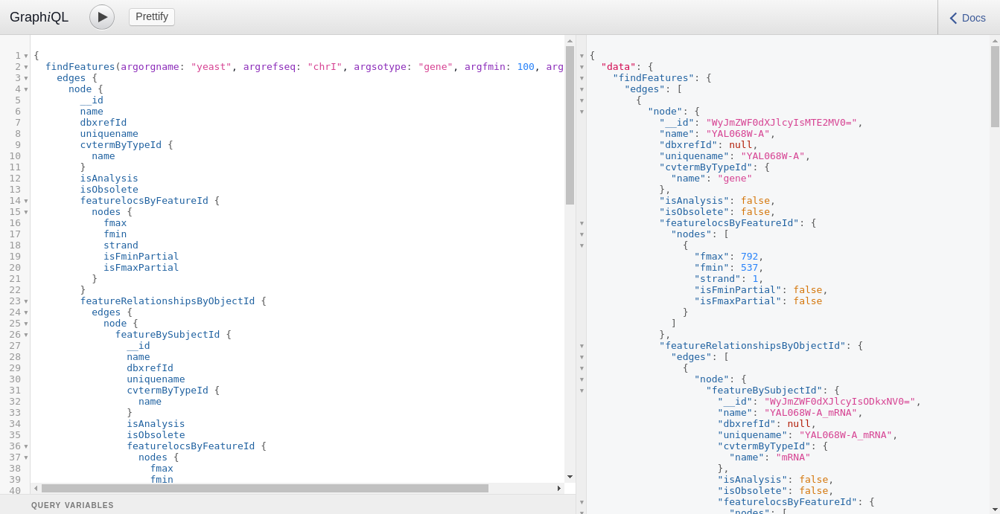
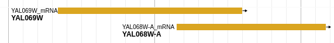

# JBrowse PostGraphQL Backend

A JBrowse plugin for talking directly to Chado databases exposed by [PostGraphQL](https://github.com/calebmer/postgraphql).
Plugin consists of a storeClass that lightly wraps the default REST.js implementation.

GraphQL offers a very simple-to-write language for recursive and nested queries:


Which translates easily into the nested feature model used by genomics data:


## Example configuration

```json
{
"baseUrl"    : "http://localhost:5000/",
"label"      : "GraphQL",
"key"        : "PostGraphQL Features",
"type"       : "JBrowse/View/Track/CanvasFeatures",
"storeClass" : "PostGraphQL/Store/SeqFeature/GraphQL",
}
```
